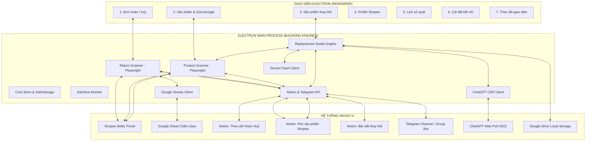

# TÀI LIỆU TOÀN DIỆN HỆ THỐNG: SHOPEE RETURN & PRODUCT MANAGER (FULL SPECIFICATION)
> **Phiên bản:** 1.6.23  
> **Dự án:** Shopee Return & Product Management System (SRM)  
> **Mục tiêu:** Tài liệu kỹ thuật chi tiết toàn bộ chức năng của hệ thống để tích hợp trực tiếp vào **MCP Server Shopee Khải Hoàn** (Model Context Protocol).

---

## 1. TỔNG QUAN HỆ THỐNG (SYSTEM OVERVIEW)

Hệ thống **Shopee Return & Product Manager (SRM)** là giải pháp tự động hóa toàn diện dành cho các gian hàng Shopee của Khải Hoàn, chạy trên nền tảng **Electron + Playwright + Node.js (Windows)**. Hệ thống kết nối đa kênh giữa **Shopee Seller Portal**, **Google Sheets**, **Notion Database**, **Telegram Bot**, **Gemini API**, và **ChatGPT Chrome CDP**.

Hệ thống bao gồm **7 phân hệ cốt lõi**:
1. **Quản lý Đơn hoàn / Huỷ (Return & Refund Tracking):** Tự động quét đơn hoàn huỷ, phân tích màu sắc trực quan, đối chiếu chéo 2 chiều với Google Sheet chiều giao, đẩy Notion và bắn cảnh báo Telegram.
2. **Quản lý Kho sản phẩm & Thao tác nhanh (Product Scanner & Quick Actions):** Quét toàn bộ danh mục sản phẩm, đồng bộ kho Notion, sửa giá bán và **sửa tồn kho về 0** hàng loạt/đơn lẻ để khoá bán tức thì.
3. **Thay thế sản phẩm (Replacement Studio):** Quy trình 3 bước tự động thay thế sản phẩm cũ bị khoá/hỏng thành sản phẩm mới chuẩn SEO & chuyển đổi (Gemini viết bài $\rightarrow$ ChatGPT tạo 5 ảnh $\rightarrow$ Điền Shopee & cập nhật Notion).
4. **Quản lý Profile Shopee (Multi-Account Session):** Quản lý nhiều tài khoản/shop độc lập qua các Profile Chrome riêng biệt, lưu trữ cookie bền vững.
5. **Giám sát giao diện Shopee (Interface Monitor):** Chủ động theo dõi sự thay đổi layout/DOM selector của Shopee Seller Portal, chụp bằng chứng lỗi và cảnh báo người dùng.
6. **Lịch sử quét & Kiểm toán (Audit Logs):** Ghi vết chi tiết từng tác vụ, nhật ký sửa giá/kho, mã trạng thái lỗi.
7. **Cài đặt kết nối & Bảo mật (Settings & SafeStorage):** Mã hóa toàn bộ token (Notion, Telegram, Gemini) bằng Electron `safeStorage` (Windows DPAPI).

---

## 2. KIẾN TRÚC TỔNG THỂ & SƠ ĐỒ KẾT NỐI



---

## 3. CHI TIẾT CÁC PHÂN HỆ CHỨC NĂNG

### PHÂN HỆ 1: QUẢN LÝ ĐƠN HOÀN / HUỶ (RETURNS & REFUNDS)

#### 1.1. Mục đích & Nguyên lý hoạt động
- **Mục đích:** Tự động phát hiện các đơn hàng phát sinh yêu cầu Trả hàng / Hoàn tiền hoặc Huỷ trên Shopee Seller Portal, đối chiếu với danh sách vận đơn gửi đi từ kho (Google Sheets) để phát hiện sớm các đơn bị thất lạc, hoàn hàng, hoặc khách boom hàng.
- **URL Shopee:** `https://banhang.shopee.vn/portal/sale/returnrefundcancel`.

#### 1.2. Kỹ thuật bóc tách dữ liệu thị giác (Visual Geometry Scraping)
Thay vì đọc selector văn bản dễ bị Shopee A/B test làm thay đổi, tool sử dụng kỹ thuật nhận diện **Visual Layout & Computed Color**:
1. Xác định vị trí cột heading: `"Vận chuyển chiều giao hàng"`.
2. Trích xuất thẻ tag trạng thái (`.tag .eds-tag`) và phân tích mã màu computed RGB:
   - **Màu Đỏ (`red`):** `r > 120 && r > g * 1.7 && r > b * 1.3` $\rightarrow$ Đơn hàng giao không thành công / hoàn về.
   - **Màu Xanh (`green`):** `g > 70 && g > r * 1.12 && g > b * 1.05` $\rightarrow$ Đơn giao thành công nhưng có yêu cầu hoàn trả.
3. Trích xuất mã đơn hàng (`orderId`) bằng Regex: `/^[A-Z0-9]{8,30}$/`.
4. Trích xuất trạng thái xử lý Shopee (`orderStatus`): Đang khiếu nại, Đã hoàn tiền, Shopee đang xem xét...

#### 1.3. Cơ chế đối chiếu 2 chiều với Google Sheet (Bi-Directional Reconciliation)
- Tải danh sách vận đơn chiều giao từ Google Sheet qua `sheets.cjs`.
- **Quy tắc đối chiếu nghiêm ngặt:**
  - Chỉ chấp nhận các đơn hàng có `orderId` trên Shopee khớp **chính xác 1-1** với đúng một mã vận đơn trong Google Sheet.
  - Từ chối tự động gửi thông báo hoặc đẩy Notion nếu phát hiện: mã đơn trùng lặp, mã vận đơn giả định (placeholder), hoặc lỗi phân trang.

#### 1.4. Đồng bộ Notion Database & Telegram Alert
- **Notion Database:** Tạo và cập nhật bảng `Theo dõi hoàn huỷ Shopee`.
  - Properties: `Mã đơn hàng` (title), `Profile` (rich_text), `Vận chuyển chiều giao hàng` (rich_text), `Màu` (select: Đỏ/Xanh), `Xử lý` (select: Mới/Shipper/Đã nhận), `Phát hiện lúc` (date), `Cập nhật lúc` (date).
  - Nguyên tắc **Immutable Downstream:** Không bao giờ ghi đè lên các cột ghi chú do nhân viên xử lý đơn nhập tay trên Notion.
- **Telegram Bot Alert:**
  - Khi phát hiện đơn hoàn huỷ mới: Gửi tin nhắn tức thì về nhóm Telegram theo định dạng chuẩn (Mã đơn, Profile shop, Trạng thái vận chuyển, Màu cảnh báo).

---

### PHÂN HỆ 2: QUẢN LÝ KHO SẢN PHẨM & SỬA GIÁ / SỬA TỒN KHO

#### 2.1. Quét danh mục sản phẩm (Product Catalog Scanner)
- **URL Shopee:** `https://banhang.shopee.vn/portal/product/list/live/all?operationSortBy=recommend_v2`.
- **Cơ chế phân trang tự động:**
  - Tự động chuyển page size sang **48 sản phẩm/trang** để tối ưu tốc độ quét.
  - Bóc tách toàn diện dữ liệu:
    - `productId`: ID sản phẩm Shopee (duy nhất).
    - `modelId`: ID phân loại biến thể (nếu có).
    - `name`: Tên sản phẩm đầy đủ.
    - `variant`: Tên phân loại (ví dụ: `Hộp 30 viên`, `Tuýp 50ml`...).
    - `price`: Giá niêm yết hiện tại.
    - `stock`: Tồn kho thực tế.
- **Xử lý số rút gọn của Shopee:**
  - Nếu tồn kho bị Shopee hiển thị dạng rút gọn (ví dụ: `1.2k`, `50k`), tool tự động click vào ô tồn kho để mở popup `.eds-modal__content`, đọc giá trị chính xác (`exactStock`), sau đó bấm hủy bỏ để đóng popup mà không làm thay đổi dữ liệu.
- **Đồng bộ tự động lên Notion Database "Kho sản phẩm Shopee":**
  - Database ID: `3e070655-a9aa-816c-98f4-dc2c863fa5bb`.
  - Cập nhật tự động: `Tên sản phẩm`, `Tên shop`, `Giá bán`, `Kho hàng`, `ID sản phẩm`, `Model ID`, `Phân loại`, `Quét lúc`.

#### 2.2. Tính năng sửa giá bán & Sửa tồn kho về 0 (Stock/Price Modification)
Đây là công cụ chiến lược để nhân viên xử lý nhanh khi sản phẩm hết hàng hoặc cần điều chỉnh giá:
1. **Sửa tồn kho về 0 (Quick Zero Stock):**
   - Đưa nhanh tồn kho của sản phẩm hoặc từng biến thể về `0` để khóa bán trên Shopee tức thì.
2. **Sửa giá bán (Price Update):**
   - Hỗ trợ đổi giá bán mới cho sản phẩm.
3. **Cơ chế an toàn 4 bước (Safety Guards):**
   - **Bước 1 (Find):** Tìm chính xác sản phẩm qua thanh tìm kiếm bằng `productId`.
   - **Bước 2 (Baseline Verification):** Mở popup sửa, đọc giá trị hiện tại từ Shopee. Nếu giá/kho hiện tại khác với dữ liệu vừa quét (do đang chạy flash sale hoặc có đơn mới), tool **từ chối sửa** để tránh xung đột.
   - **Bước 3 (Isolated Input):** Chỉ điền vào đúng ô input của phân loại được chỉ định. Nếu phát hiện các input khác bị thay đổi ngoài ý muốn, lập tức hủy bỏ.
   - **Bước 4 (Fresh Read Re-verification):** Sau khi bấm Lưu trên popup Shopee, tool tải lại trang và đọc lại giá trị mới trực tiếp từ bảng sản phẩm để xác minh 100% Shopee đã nhận giá trị mới trước khi báo thành công.

---

### PHÂN HỆ 3: THAY THẾ SẢN PHẨM (REPLACEMENT STUDIO)

Quy trình 3 bước khép kín đã được chuẩn hóa để chuyển đổi sản phẩm cũ bị hạn chế/hỏng thành sản phẩm mới:

#### 3.1. Bước 1: Sinh nội dung & Duyệt bài (Gemini + Notion)
- Sử dụng Gemini API (`gemini-2.5-flash`) sinh tiêu đề chuẩn SEO, mô tả bài viết và phân loại.
- Đẩy bài lên Notion page dưới dạng khối mã JSON (`schemaVersion: 1`).
- Nhân viên duyệt nội dung $\rightarrow$ Khóa toàn vẹn bằng **`contentDigest`** (SHA-256).

#### 3.2. Bước 2: Tạo bộ 5 ảnh sản phẩm thương mại (ChatGPT CDP)
- **5 Prompts chuẩn hóa:**
  1. `Ảnh bìa` (1.png): Đính kèm ảnh mẫu bao bì gốc, bối cảnh 3D chuyên nghiệp.
  2. `Thành phần nổi bật` (2.png): Visual hóa hoạt chất.
  3. `Công dụng chính` (3.png): Hình ảnh công dụng và lợi ích cốt lõi.
  4. `Cách dùng` (4.png): Hướng dẫn sử dụng trực quan.
  5. `Điểm tin cậy / Proof` (5.png): Giấy tờ, chứng nhận chất lượng.
- **Tương tác Chrome Debug (Port 9222):**
  - Chống timeout: Gõ `Enter` vào composer, click nút Send bằng `force: true` (2.5s) và fallback qua DOM dispatch.
  - Sharp nén ảnh JPG dưới 1.9MB lưu local theo cấu trúc: `[Drive Local]/[Shop]/[ProductID] - [ProductName]/[1-5].png`.
  - Hỗ trợ chạy đơn lẻ từng ảnh (`run-single`) hoặc chạy tiếp các ảnh còn thiếu (`run-all`), tự phục hồi trạng thái `uncertain`.
- **Gắn ảnh Notion (`studio-attach`):** Tự động đính kèm 5 ảnh đã nén vào bài Notion.

#### 3.3. Bước 3: Cập nhật Shopee Portal & Đồng bộ Notion
- Nút **"Thay thế lên Shopee" (`studio-replace`):**
  - Mở profile Chrome liên kết với shop của sản phẩm.
  - Vào thẳng form sửa sản phẩm: `https://banhang.shopee.vn/portal/product/[productId]?pageEntry=product_list`.
  - Điền tự động: 5 ảnh mới đã nén, Tên mới, Mô tả mới, Giá mới.
  - **Giữ nguyên màn hình** để nhân viên rà soát và tự tay bấm "Cập nhật".
- **Đồng bộ Notion Database "Kho sản phẩm Shopee" (`3e070655a9aa816c98f4dc2c863fa5bb`):**
  - Đổi `Tên sản phẩm` $\rightarrow$ Tên mới.
  - Đổi `Giá bán` $\rightarrow$ Giá mới.
  - Đổi `Cần thay thế` $\rightarrow$ `Đã thay thế`.
  - Điền vết thay thế vào cả 2 cột **`Ghi chú`** và **`Ghi chú thay thế`**:  
    `Sửa từ: [Tên SP cũ] (ID: [ProductID]) lúc [Thời gian]`.

---

### PHÂN HỆ 4: QUẢN LÝ PROFILE SHOPEE (MULTI-ACCOUNT MANAGEMENT)

- **Nguyên tắc cô lập:** Mỗi shop Shopee (ví dụ: `khaihoanpharmacy`, `nhathuockh.pharma`) được gắn chặt với một **Profile ID** riêng.
- **Dữ liệu Profile:**
  - Lưu trữ session, cookie, local storage, indexedDB độc lập trong thư mục `profiles/[profileId]`.
  - Nhân viên chỉ cần đăng nhập thủ công trên Chrome một lần duy nhất; session được duy trì vĩnh viễn qua các lần chạy app.
- **Kiểm soát đăng nhập sai tài khoản (Account Drift Protection):**
  - Trước khi quét hoặc sửa giá/kho/sản phẩm, tool đọc username shop hiển thị ở góc trên của Shopee Portal (`.account-info .subaccount-name`).
  - Nếu username trên trình duyệt khác với tên shop đã gán cho profile trong cấu hình, tool **lập tức ngắt kết nối** và báo lỗi, tuyệt đối không thao tác để tránh sửa nhầm gian hàng.

---

### PHÂN HỆ 5: THEO DÕI GIAO DIỆN SHOPEE (INTERFACE MONITOR)

Shopee thường xuyên cập nhật giao diện web làm thay đổi DOM selector. Phân hệ này hoạt động như một hệ thống "cảnh báo sớm":
- **Kiểm tra định kỳ (Probes):**
  - Kiểm tra tính tồn tại của selector bảng đơn hàng, cột vận chuyển, danh sách sản phẩm, popup sửa giá, popup sửa kho hàng.
- **Ghi nhận bằng chứng lỗi (Evidence Capture):**
  - Khi một thao tác gặp lỗi do selector không tìm thấy: Tự động chụp lại ảnh màn hình (screenshot) và lưu trữ DOM snapshot HTML tại thời điểm đó vào thư mục `interface-monitor`.
- **Cảnh báo đỏ (Red Alert):**
  - Hiển thị badge cảnh báo đỏ trên menu điều hướng của tool để quản trị viên biết chính xác thành phần nào của Shopee vừa thay đổi và cần cập nhật code.

---

### PHÂN HỆ 6: LỊCH SỬ QUÉT & KIỂM TOÁN (AUDIT LOGS)

- **Cấu trúc Log chuẩn (JSON Structured Logging):**
  - Mỗi bản ghi gồm: `id` (UUID), `at` (ISO timestamp), `level` (`info`, `warn`, `error`), `module` (`returns`, `products`, `replacement`, `settings`), `message` (nội dung chi tiết).
- **Lưu trữ bền vững:** Lưu vào `data/logs.json` (giới hạn 500 bản ghi mới nhất để tối ưu hiệu năng).
- **An toàn bảo mật:** Tất cả token, API key, mật khẩu đều được hàm `cleanError()` tự động che giấu (`[đã ẩn]`) trước khi ghi vào log.

---

### PHÂN HỆ 7: CÀI ĐẶT KẾT NỐI & BẢO MẬT (SETTINGS & SAFESTORAGE)

- **Cơ chế mã hóa SafeStorage:**
  - File `credentials.enc` lưu trữ: `notionToken`, `telegramToken`, `telegramChatId`, `geminiApiKey`.
  - Sử dụng API `safeStorage.encryptString()` của Electron, gắn với khóa mã hóa bảo mật của hệ điều hành Windows (DPAPI), ngăn chặn việc đánh cắp token khi copy file dữ liệu sang máy tính khác.
- **Cấu hình quét tự động:**
  - `autoScan`: Bật/tắt quét nền định kỳ.
  - `intervalMinutes`: Khoảng thời gian giữa các lượt quét (ví dụ: 15 phút, 30 phút, 60 phút).
  - `keepAwake`: Giữ hệ điều hành Windows không rơi vào trạng thái Sleep/Suspend khi đang bật tự động quét.

---

## 4. DANH MỤC ĐẦY ĐỦ CÁC IPC HANDLERS (DÙNG ĐỂ BỌC TOOL CHO MCP SERVER)

Dưới đây là danh sách toàn bộ các hàm backend có thể gọi trực tiếp từ Main Process hoặc IPC, phục vụ việc bọc thành các Tools cho **MCP Shopee Khải Hoàn**:

### 4.1. Đơn hoàn / huỷ (Returns)
| IPC Channel | Tham Số | Mô Tả Chức Năng |
| :--- | :--- | :--- |
| `scan-now` | Không | Kích hoạt quét đơn hoàn huỷ trên tất cả các profile Shopee ngay lập tức. |
| `clear-notion` | Không | Xóa trắng dữ liệu đơn hàng trên Notion để quét lại từ đầu (có backup tự động). |
| `open-sheet` | Không | Mở link Google Sheet vận đơn chiều giao trên trình duyệt. |

### 4.2. Sản phẩm & Sửa giá/kho (Products)
| IPC Channel | Tham Số | Mô Tả Chức Năng |
| :--- | :--- | :--- |
| `products-scan` | `profileId?` | Quét toàn bộ danh mục sản phẩm của một hoặc tất cả các shop. |
| `products-edit` | `rowId, field ('price'/'stock'), value, expected` | Sửa giá bán hoặc tồn kho của một sản phẩm/phân loại cụ thể. |
| `products-batch-edit` | `items: [{rowId, field, value, expected}]` | Thực thi sửa hàng loạt giá hoặc tồn kho (ví dụ: đưa hàng loạt sản phẩm về tồn kho 0). |
| `products-open-notion` | `url` | Mở trang sản phẩm trên Notion. |

### 4.3. Sản phẩm thay thế (Replacement Studio)
| IPC Channel | Tham Số | Mô Tả Chức Năng |
| :--- | :--- | :--- |
| `studio-load` | Không | Tải danh sách các tác vụ thay thế sản phẩm đang có. |
| `studio-create` | `{rowIds: string[]}` | Khởi tạo tác vụ thay thế từ các sản phẩm cũ được chọn. |
| `studio-generate` | `jobId, targetTitle, prompt, model` | Gọi Gemini sinh bài viết chuẩn SEO cho sản phẩm thay thế. |
| `studio-publish-article`| `jobId` | Đẩy bài viết đã sinh lên trang Notion. |
| `studio-approve` | `jobId` | Xác nhận bài viết Notion đã duyệt để chuyển sang bước tạo ảnh. |
| `studio-image-prompts` | `jobId` | Đọc bài viết Notion và sinh 5 prompts tạo ảnh thương mại. |
| `studio-image-prompt-update` | `jobId, slotIndex, text` | Cập nhật nội dung tùy chỉnh cho prompt tại vị trí `slotIndex` (0 - 4). |
| `studio-image-prompt-reset` | `jobId, slotIndex` | Khôi phục prompt tại vị trí `slotIndex` về giá trị mặc định. |
| `studio-image-reference-pick` | `jobId` | Chọn file ảnh mẫu sản phẩm gốc làm tham chiếu bao bì cho ChatGPT. |
| `studio-chatgpt-open` | Không | Khởi động trình duyệt Chrome với cổng Debug 9222. |
| `studio-chatgpt-test` | Không | Kiểm tra kết nối tới tab ChatGPT đang mở. |
| `studio-cdp-run` | `jobId, selectionId, digest, slot?` | Gửi prompt sang ChatGPT tạo ảnh: nếu có `slot` thì tạo lẻ ảnh đó; nếu không có thì tạo tiếp các ảnh còn thiếu. |
| `studio-attach` | `jobId` | Nén 5 ảnh PNG thành JPG dưới 1.9MB và cập nhật link vào bài Notion. |
| `studio-replace` | `jobId` | Tự động mở Shopee Portal điền 5 ảnh, tên, mô tả, giá và cập nhật Notion. |
| `studio-clear-image-logs` | `jobId` | Xóa nhật ký xử lý ảnh của tác vụ. |

### 4.4. Profile & Cấu hình (Profiles & Settings)
| IPC Channel | Tham Số | Mô Tả Chức Năng |
| :--- | :--- | :--- |
| `profile-create` | `{name}` | Tạo một Profile Chrome mới cho shop. |
| `profile-login` | `profileId` | Mở cửa sổ Chrome độc lập để nhân viên đăng nhập Shopee Portal. |
| `profile-delete` | `profileId` | Xóa Profile và toàn bộ dữ liệu session liên quan. |
| `save-settings` | `settingsObject` | Lưu cấu hình tự động quét, Notion Token, Telegram Token, Google Sheet. |
| `studio-config` | `configObject` | Lưu cấu hình Gemini Key, Gemini Model, Drive Local Folder, ChatGPT Port. |

---

## 5. CẤU TRÚC FILE DỮ LIỆU & ĐƯỜNG DẪN HỆ THỐNG

Toàn bộ dữ liệu của ứng dụng được lưu trữ an toàn trong thư mục `%APPDATA%\ShopeeReturns\data\`:

```
%APPDATA%\ShopeeReturns\
├── data/
│   ├── credentials.enc                # Khóa & Token mã hóa an toàn bằng DPAPI
│   ├── state.json                     # Cấu hình cài đặt, danh sách đơn hàng, profiles
│   ├── products.json                  # Dữ liệu danh mục sản phẩm, cache Notion databaseId
│   ├── logs.json                      # Nhật ký hệ thống (Audit Logs)
│   ├── profiles/                      # Thư mục lưu User Data của từng Chrome Profile
│   │   ├── [profile-uuid-1]/
│   │   └── [profile-uuid-2]/
│   ├── interface-monitor/             # Bằng chứng lỗi giao diện Shopee (Screenshots & DOM)
│   ├── replacement-studio/
│   │   ├── state.json                 # Trạng thái toàn bộ các tác vụ thay thế sản phẩm
│   │   ├── prompts.json               # Thư viện prompt mẫu
│   │   └── assets/[jobId]/            # Thư mục lưu ảnh đệm của tác vụ thay thế
│   └── chatgpt-studio/[jobId]/
│       ├── journal.json               # Nhật ký trạng thái gửi từng ảnh lên ChatGPT
│       ├── reference.png              # Ảnh mẫu bao bì gốc
│       └── [1-5].png                  # File ảnh gốc chất lượng cao tải từ ChatGPT
└── electron/                          # Dữ liệu Chromium runtime của Electron
```

---

## 6. HƯỚNG DẪN TÍCH HỢP VÀO MCP SHOPEE KHẢI HOÀN

Khi tích hợp vào MCP Server:
1. **Chế độ Headless vs GUI:** Các phân hệ quét đơn và đồng bộ Notion có thể chạy hoàn toàn nền (`headless: true`). Riêng phân hệ `studio-replace` (điền sản phẩm Shopee) và `studio-cdp-run` (ChatGPT) nên chạy ở chế độ có giao diện (`headless: false`) để nhân viên có thể tương tác và xác nhận.
2. **Quản lý khóa Token:** Khuyến nghị đọc trực tiếp từ biến môi trường của MCP Server hoặc qua file `credentials.enc` hiện tại để bảo toàn tính an toàn.
3. **Đồng bộ hóa 2 chiều:** Sử dụng các event emitter để MCP client có thể theo dõi tiến độ từng bước (ví dụ: tạo ảnh 1/5, 2/5... hoặc phân trang quét sản phẩm).
