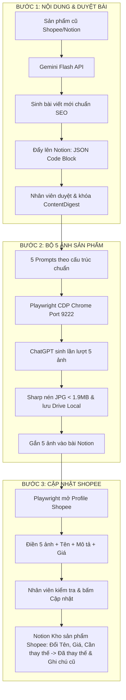

# TÀI LIỆU KỸ THUẬT & KIẾN TRÚC HỆ THỐNG: SHOPEE REPLACEMENT STUDIO
> **Phiên bản:** 1.6.23  
> **Mục đích:** Tích hợp trực tiếp vào hệ sinh thái MCP Server Shopee Khải Hoàn (Model Context Protocol).  
> **Chức năng chính:** Tự động hóa quy trình thay thế sản phẩm cũ trên Shopee bằng sản phẩm mới chuẩn SEO & chuyển đổi cao, quản lý trạng thái qua Notion Database và điều khiển trình duyệt qua Playwright CDP.

---

## 1. TỔNG QUAN KIẾN TRÚC HỆ THỐNG (SYSTEM ARCHITECTURE)

Hệ thống được thiết kế theo kiến trúc **Event-Driven & State-Machine** kết hợp **Atomic Persistence**, phân tách rõ ràng giữa 3 tầng:

1. **Presentation & Controller (Electron Main & Renderer):**
   - Quản lý giao diện vận hành, cấu hình kết nối, xử lý tương tác người dùng và phản hồi trực quan theo thời gian thực (IPC Channel).
2. **Business Automation Core (Replacement Studio Engine):**
   - Điều phối quy trình thay thế 3 bước khép kín.
   - Cơ chế xác thực tính toàn vẹn dữ liệu bằng Content Digest (SHA-256).
   - Kiểm soát trạng thái đơn lẻ (Per-slot Turn) và nhật ký phục hồi (Journal Recovery).
3. **Integration Adapters (Bên ngoài):**
   - **Google Gemini API:** Sinh bài viết chuẩn SEO và phân tích insight sản phẩm.
   - **ChatGPT Playwright CDP (Port 9222):** Tự động hóa tương tác với giao diện ChatGPT để sinh 5 ảnh sản phẩm thương mại.
   - **Google Drive Local Storage:** Đồng bộ và lưu trữ ảnh gốc PNG chất lượng cao theo cấu trúc phân cấp Shop/Product.
   - **Notion Database API (v1):** Quản lý trạng thái, lưu trữ bài viết mẫu (JSON Block) và kho sản phẩm online.
   - **Shopee Seller Portal Automation:** Mở profile Chrome riêng biệt, tìm kiếm và điền tự động bộ ảnh, tên, mô tả, giá bán lên form chỉnh sửa sản phẩm Shopee.



---

## 2. QUY TRÌNH NGHIỆP VỤ 3 BƯỚC CHI TIẾT (3-STEP PIPELINE)

### BƯỚC 1: SINH NỘI DUNG & DUYỆT BÀI VIẾT (CONTENT ENGINE)
1. **Thu thập dữ liệu nguồn:**
   - Lấy thông tin sản phẩm cần thay thế từ Notion Database "Kho sản phẩm Shopee": `shop`, `productId`, `modelId`, `name`, `price`, `category`.
2. **Khai thác AI (Gemini 2.5 Flash / 3.x):**
   - Input: Tên sản phẩm mới, từ khóa insight, phân loại ngành hàng, cấu trúc tham chiếu.
   - Output: JSON hợp lệ chứa:
     - `name`: Tên sản phẩm mới chuẩn SEO (tối đa 120 ký tự, chứa từ khóa chính + thương hiệu + công dụng).
     - `description`: Mô tả chi tiết phân đoạn (Giới thiệu, Thành phần, Công dụng, Hướng dẫn sử dụng, Cam kết chất lượng).
     - `category`: Ngành hàng phù hợp.
     - `variants`: Danh sách phân loại và giá bán.
3. **Đẩy bài Notion & Khóa toàn vẹn (Content Digest):**
   - Đẩy bản nháp lên Notion page dưới dạng `code` block JSON (Schema version 1).
   - Tạo mã băm `contentDigest = SHA256(JSON.stringify(article))`.
   - Nhân viên có thể chỉnh sửa trực tiếp trên tool hoặc trên Notion. Mọi thao tác ở Bước 2 đều kiểm tra tính hợp lệ của `contentDigest`.

---

### BƯỚC 2: TẠO BỘ 5 ẢNH THƯƠNG MẠI (COMMERCIAL IMAGES GENERATOR)
1. **Cấu trúc 5 Prompts chuyên sâu:**
   - **Ảnh 1 (1.png - Cover):** Ảnh bìa thương mại, đính kèm ảnh sản phẩm gốc làm tham chiếu bao bì, góc chụp chính diện 3D, nền sạch, bố cục chuẩn e-commerce.
   - **Ảnh 2 (2.png - Ingredients):** Thành phần nổi bật, visual hóa các hoạt chất chính, giữ phong cách đồng bộ từ ảnh 1.
   - **Ảnh 3 (3.png - Benefits):** Công dụng chính của sản phẩm, hình ảnh minh họa tác động, giữ bao bì chuẩn.
   - **Ảnh 4 (4.png - Usage):** Hướng dẫn sử dụng, bối cảnh thực tế hoặc các bước dùng trực quan.
   - **Ảnh 5 (5.png - Trust/Proof):** Chứng nhận, cam kết chất lượng, bảo chứng thương hiệu.
2. **Tùy biến Prompt trên giao diện:**
   - Hỗ trợ sửa trực tiếp nội dung từng prompt (`studio-image-prompt-update`).
   - Nút **"Lưu prompt"** (`studio-chrome-prompt-save`): Lưu tức thì vào cấu hình tác vụ.
   - Nút **"Khôi phục prompt mặc định"** (`studio-image-prompt-reset`) và **"Xóa trắng prompt"**.
3. **Cơ chế tương tác ChatGPT qua Chrome Debug (Port 9222):**
   - Kết nối trình duyệt Chrome sẵn có qua giao thức CDP (`chromium.connectOverCDP`).
   - Tự động nhận diện URL cuộc trò chuyện (`https://chatgpt.com/c/...`) và lưu vết vào `journal.json`.
   - **Cơ chế gửi lệnh chống treo (Timeout-Free Dispatch):**
     1. Focus vào ô soạn thảo, ép gửi phím `Enter` bằng `page.keyboard.press('Enter')`.
     2. Click nút Send với `force: true` kèm timeout ngắn (2.5 giây).
     3. Tự động fallback sang `send.dispatchEvent('click')` và `send.evaluate(b => b.click())`.
4. **Xử lý ảnh & Lưu trữ Local:**
   - Trích xuất ảnh gốc từ response của ChatGPT (Fetch blob raster).
   - Dùng thư viện `Sharp` chuẩn hóa:
     - Bản gốc: Lưu PNG chất lượng cao vào `[Drive Local]/[Shop]/[ProductID] - [ProductName]/[1-5].png`.
     - Bản xuất bản: Nén JPG dưới 1.9 MB (giới hạn của Shopee và Notion).
5. **Khả năng chạy linh hoạt (Flexibility & Fault Tolerance):**
   - Cho phép tạo đơn lẻ từng ảnh (`studio-chrome-run-single`) hoặc tiếp tục các ảnh còn thiếu (`studio-chrome-run`).
   - Khi gặp sự cố mạng hoặc dừng giữa chừng, các ảnh đã hoàn thành (`status: 'done'`) được giữ nguyên; chỉ cần chọn đúng đoạn chat cũ trên Chrome và bấm chạy tiếp các slot còn lại.
6. **Đính kèm Notion (`studio-attach`):**
   - Đọc 5 file ảnh đã nén từ local, cập nhật link vào khối bài viết Notion và đổi trạng thái job thành `images-ready`.

---

### BƯỚC 3: CẬP NHẬT TRỰC TIẾP LÊN SHOPEE (SHOPEE AUTO FILLER)
1. **Kích hoạt thay thế (`studio-replace`):**
   - Kiểm tra điều kiện tiên quyết: Đã có đủ 5 ảnh local (hoặc đã gắn Notion).
   - Xác định chính xác Profile Chrome liên kết với shop của sản phẩm (ví dụ: `khaihoanpharmacy`).
   - Mở cửa sổ Chrome độc lập với profile tương ứng.
2. **Điều hướng & Điền form Shopee Portal:**
   - URL: `https://banhang.shopee.vn/portal/product/[productId]?pageEntry=product_list`.
   - Chờ form tải hoàn tất, điền:
     - Tải lên lần lượt bộ 5 ảnh mới đã nén (thay thế bộ ảnh cũ).
     - Cập nhật Tên sản phẩm mới.
     - Cập nhật Mô tả sản phẩm mới.
     - Cập nhật Giá bán mới (áp dụng cho cả sản phẩm đơn và các phân loại variants).
     - Giữ nguyên tồn kho (stock) hiện có trên sàn để tránh vi phạm chính sách Shopee.
   - **Giữ nguyên trạng thái hiển thị:** Không tự động bấm nút "Cập nhật" cuối cùng của Shopee mà giữ màn hình để nhân viên kiểm tra lần cuối rồi tự tay bấm xác nhận.
3. **Đồng bộ ngược Notion Database ("Kho sản phẩm Shopee"):**
   - Database ID: `3e070655-a9aa-816c-98f4-dc2c863fa5bb`.
   - Cập nhật các trường:
     - `Tên sản phẩm`: Tên sản phẩm mới.
     - `Giá bán`: Giá bán mới.
     - `Cần thay thế`: Chuyển sang `Đã thay thế`.
     - `Ghi chú` & `Ghi chú thay thế`: Tự động điền nội dung vết:  
       `Sửa từ: [Tên sản phẩm cũ] (ID: [ProductID]) lúc [Thời gian]`
     - `Quét lúc`: Cập nhật timestamp hiện tại.

---

## 3. CẤU TRÚC DỮ LIỆU & SCHEMAS (DATA CONTRACTS)

### 3.1. Notion Database "Kho sản phẩm Shopee" Schema
*Database ID:* `3e070655-a9aa-816c-98f4-dc2c863fa5bb`

| Tên Cột | Kiểu Dữ Liệu (Notion Type) | Mô Tả & Quy Tắc |
| :--- | :--- | :--- |
| **Tên sản phẩm** | `title` | Tên hiển thị của sản phẩm (cập nhật tên mới sau khi thay thế). |
| **Giá bán** | `number` | Giá niêm yết của sản phẩm (cập nhật giá mới). |
| **ID sản phẩm** | `rich_text` | Shopee Product ID (duy nhất theo sản phẩm). |
| **Model ID** | `rich_text` | Shopee Model ID (phân loại biến thể). |
| **Kho hàng** | `number` | Tồn kho hiện tại. |
| **Phân loại** | `rich_text` | Tên biến thể (nếu có). |
| **Tên shop** | `rich_text` | Username shop bán lẻ (ví dụ: `khaihoanpharmacy`). |
| **Quét lúc** / **Thời gian** | `date` | Thời điểm quét hoặc thời điểm cập nhật mới nhất. |
| **Cần thay thế** | `select` | Trạng thái: `Chưa thay thế` hoặc `Đã thay thế`. |
| **Sản phẩm thay thế** | `url` | Link bài viết Notion mẫu tương ứng. |
| **Ghi chú** | `rich_text` | Lịch sử vết: `Sửa từ: [Tên SP cũ] (ID: [ID]) lúc [Thời gian]`. |
| **Ghi chú thay thế** | `rich_text` | Cột dự phòng đồng bộ song song với `Ghi chú`. |

---

### 3.2. Notion Page Article Schema (JSON Code Block)
Mỗi bài viết sản phẩm thay thế được lưu dưới dạng một khối mã `json` tại đầu Notion page:

```json
{
  "schemaVersion": 1,
  "target": {
    "shop": "khaihoanpharmacy",
    "productId": "50603772518",
    "name": "[CHE TÊN SP] Thông Tọa Y Phúc – Bổ sung Rutin & Diosmin..."
  },
  "product": {
    "name": "Dung dịch xịt mũi Sinus Spray",
    "description": "Dung dịch xịt mũi Sinus Spray hỗ trợ làm sạch khoang mũi...",
    "category": "Sức khỏe & Sắc đẹp > Chăm sóc cá nhân > Chăm sóc mũi",
    "fields": {
      "Thương hiệu": "No brand",
      "Xuất xứ": "Việt Nam",
      "Hạn sử dụng": "36 tháng"
    },
    "variants": [
      {
        "modelId": "330358503206",
        "name": "",
        "price": 110000,
        "stock": 46
      }
    ]
  },
  "images": [
    "https://validation.local/1-hash.jpg",
    "https://validation.local/2-hash.jpg",
    "https://validation.local/3-hash.jpg",
    "https://validation.local/4-hash.jpg",
    "https://validation.local/5-hash.jpg"
  ],
  "imageFolder": "https://drive.google.com/drive/u/2/folders/...",
  "approved": true
}
```

---

### 3.3. Cấu Trúc Nhật Ký Tạo Ảnh ChatGPT (`journal.json`)
Lưu tại: `[AppData]/ShopeeReturns/data/chatgpt-studio/[jobId]/journal.json`

```json
{
  "jobId": "6ec2fd23-231a-4484-be86-5a9579c6129e",
  "requestHash": "7f8b9a...",
  "conversationUrl": "https://chatgpt.com/c/68cb6406-ae64-83ec-948e-1347e1b72b07",
  "turns": [
    {
      "status": "done",
      "path": "C:\\...\\1.png",
      "filename": "1.png",
      "hash": "e3b0c44298fc1c149afbf4c8996fb92427ae41e4649b934ca495991b7852b855"
    },
    {
      "status": "done",
      "path": "C:\\...\\2.png",
      "filename": "2.png",
      "hash": "ca978112ca1bbdcafac231b39a23dc4da786081cd1e14dd6f9b302dd3693044c"
    }
  ]
}
```
*Các trạng thái của Turn:* `submitted` (đang gửi), `uncertain` (lỗi mạng/chưa rõ kết quả), `done` (đã lưu ảnh thành công).

---

## 4. DANH MỤC API & IPC HANDLERS (DÙNG ĐỂ VIẾT MCP TOOL WRAPPER)

Khi xây dựng MCP Tool cho Shopee Khải Hoàn, có thể bọc trực tiếp các hàm xử lý sau từ các module backend:

### 4.1. Module Nội dung & Cấu hình (Gemini & Studio)
- **`studio-config`**: Cập nhật API key Gemini, cấu hình cổng Chrome Debug (mặc định 9222), thư mục Drive Local.
- **`studio-models`**: Lấy danh sách Gemini models được hỗ trợ (`gemini-2.5-flash`, `gemini-1.5-flash`...).
- **`studio-create`**: Khởi tạo tác vụ thay thế từ một hoặc nhiều `rowId` của sản phẩm cũ.
- **`studio-generate`**: Gọi Gemini API sinh bài viết mới từ sản phẩm nguồn và insight.
- **`studio-publish-article`**: Đẩy bài viết đã sinh lên Notion (tạo page mới và chèn JSON schema).
- **`studio-approve`**: Nhân viên xác nhận bài viết trên Notion là chính xác để mở khóa bước tạo ảnh.

### 4.2. Module Ảnh & Prompts (ChatGPT CDP)
- **`studio-image-prompts`**: Đọc bài viết đã duyệt từ Notion và biên soạn 5 prompts tương ứng kèm `contentDigest`.
- **`studio-image-prompt-update(jobId, slotIndex, text)`**: Cập nhật nội dung tùy chỉnh cho prompt tại slot cụ thể (0 - 4).
- **`studio-image-prompt-reset(jobId, slotIndex)`**: Khôi phục prompt về nội dung mặc định sinh từ bài viết.
- **`studio-image-reference-pick(jobId)`**: Đặt ảnh mẫu sản phẩm (file gốc) để ChatGPT tham chiếu ngoại quan.
- **`studio-chatgpt-test`**: Kiểm tra kết nối tới tab ChatGPT trên Chrome Debug (Port 9222).
- **`studio-cdp-run(jobId, selectionId, contentDigest, singleIndex?)`**:
  - Nếu `singleIndex` được truyền (0-4): Chỉ gửi prompt và lưu ảnh cho đúng vị trí đó (ví dụ Ảnh 3).
  - Nếu `singleIndex = null`: Tiếp tục chạy tuần tự tất cả các ảnh còn thiếu (từ slot chưa có đến hết).
- **`studio-attach(jobId)`**: Tự động nén 5 ảnh PNG thành JPG dưới 1.9MB và cập nhật link vào bài viết Notion.

### 4.3. Module Thay thế Shopee (Shopee Portal Automation)
- **`studio-replace(jobId)`**: Mở profile Shopee tương ứng, điều hướng đến sản phẩm, điền toàn bộ ảnh, tên, mô tả và giá mới, đồng thời cập nhật dòng sản phẩm trên Notion Database "Kho sản phẩm Shopee".

---

## 5. CÁC NGUYÊN TẮC CHỊU LỖI & PHỤC HỒI (RESILIENCY BEST PRACTICES)

1. **Chống Gửi Đè Bằng SHA-256 Digest:**
   - Bất kỳ thay đổi nào trong bài viết Notion ở bước 1 sẽ làm thay đổi `contentDigest`. Tool từ chối nhận ảnh hoặc chạy CDP nếu `contentDigest` không khớp, bảo vệ tuyệt đối việc nhầm lẫn giữa các bài viết khác nhau.
2. **Xử lý Timeout & Re-render trên ChatGPT:**
   - Tránh dùng `locator.click()` thuần túy của Playwright vì CSS transition của ChatGPT thường xuyên gây kẹt 30 giây.
   - Luôn kết hợp: `keyboard.press('Enter')` $\rightarrow$ `button.click({force: true, timeout: 2500})` $\rightarrow$ Fallback qua DOM Click.
3. **Phục Hồi Lượt Chạy Dở Dang (Single-Slot Recovery):**
   - Khi tạo dở ảnh 1 và 2 mà ảnh 3 gặp sự cố: Trạng thái `uncertain` được tự động giải phóng khi người dùng bấm tạo lại ảnh 3.
   - Giữ nguyên các turn đã `done` trong `journal.json`, không gửi lại từ đầu làm tốn quota ChatGPT.
4. **Bảo toàn Tồn kho Shopee:**
   - Khi điền giá mới lên Shopee, luôn đọc tồn kho thực tế (`live.stock`) trên sàn và gán ngược lại vào payload để tránh việc sản phẩm bị trả về tồn kho 0 gây gián đoạn bán hàng.
5. **Đồng bộ Đa Cột Notion (Multi-column Compatibility):**
   - Luôn cập nhật song song cả 2 cột `Ghi chú` và `Ghi chú thay thế`, tự động phát hiện và thêm cột vào schema nếu database chưa có.

---

## 6. DANH MỤC FILE NGUỒN CỐT LÕI (SOURCE CODE DIRECTORY)

- `src/replacement-studio.cjs`: Trái tim điều phối quy trình 3 bước, quản lý state và đồng bộ Notion.
- `src/studio-chatgpt.cjs`: Adapter điều khiển Playwright CDP tương tác ChatGPT, quản lý `journal.json` và tải ảnh.
- `src/replacement-editor.cjs`: Adapter tự động hóa Shopee Portal (đọc form, tải ảnh, điền tên/mô tả/giá).
- `src/replacements.cjs`: Quản lý template thay thế, link bài viết và kiểm soát schema Notion.
- `src/products.cjs`: Quản lý kho sản phẩm online và đồng bộ database Shopee.
- `src/studio-ui.js`: Toàn bộ logic giao diện điều khiển, render gallery 5 ảnh, quản lý prompt và bắt sự kiện.
- `src/index.html`: Cấu trúc DOM giao diện Studio và các panel thao tác.
- `src/main.cjs`: Đăng ký toàn bộ IPC handlers kết nối UI với backend engines.
